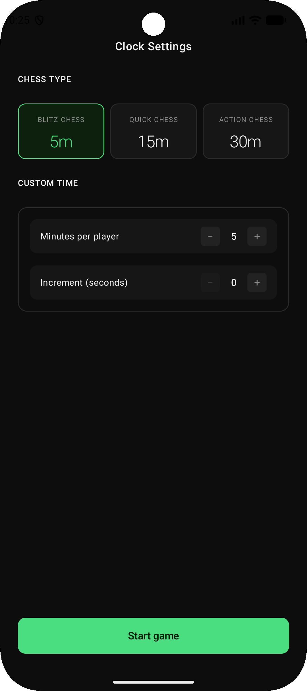
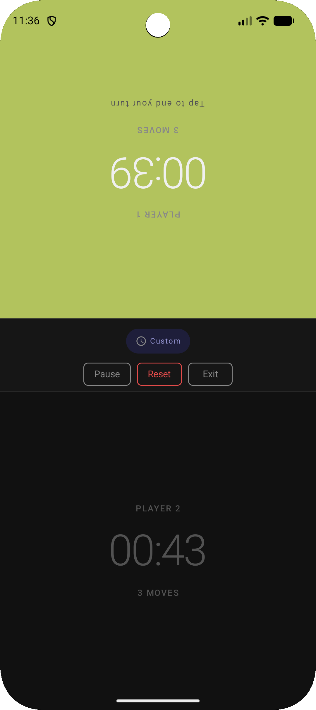
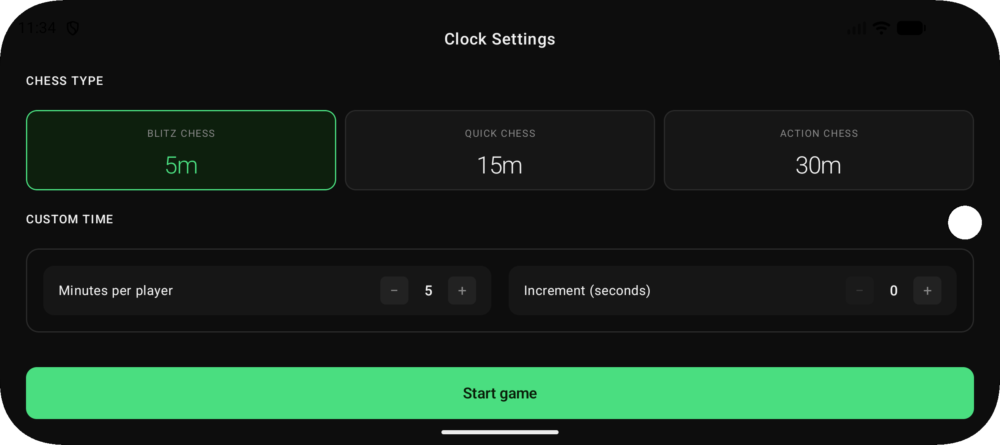
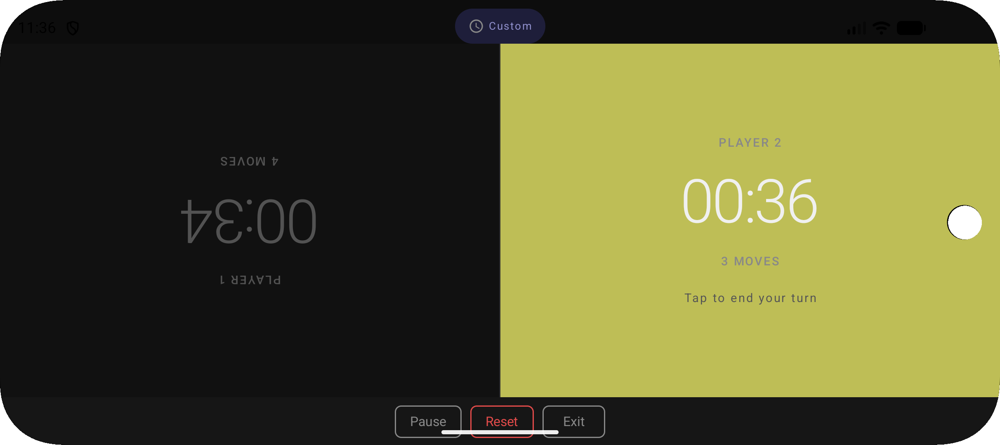
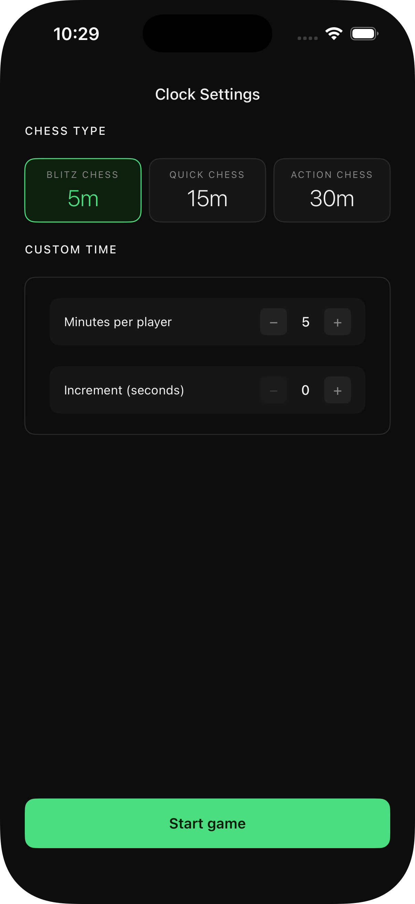
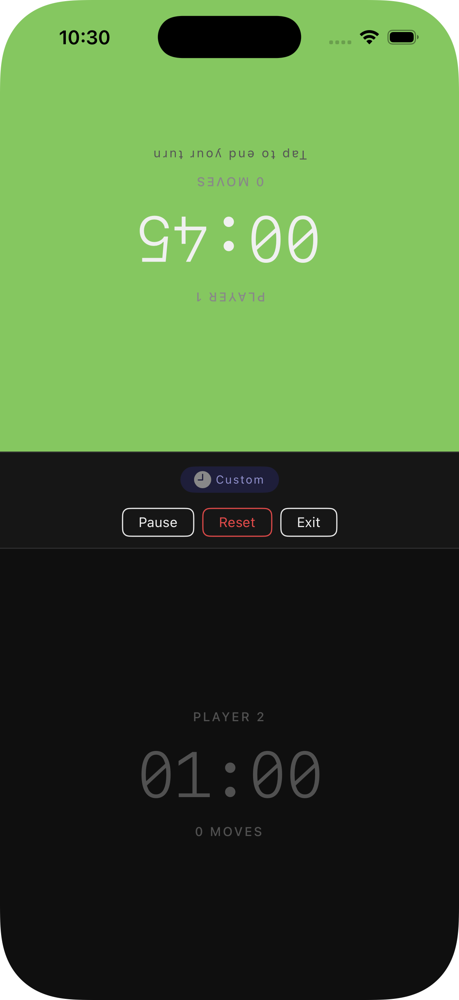
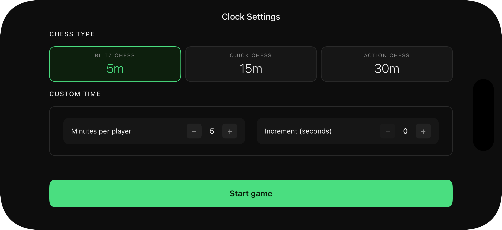
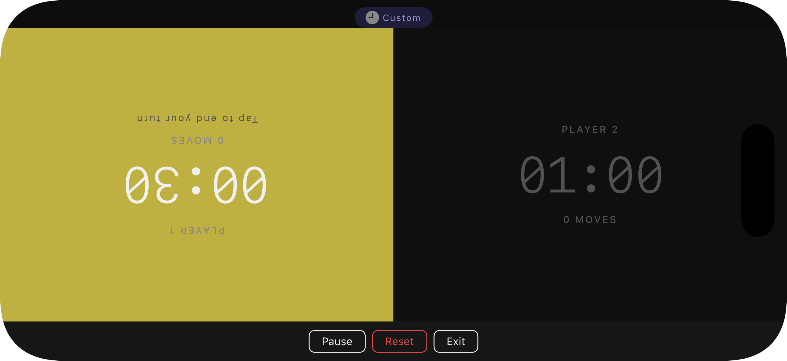

# Chess Clock App

A Kotlin Multiplatform Chess Clock application for Android and iOS. This project demonstrates sharing business logic, view models, and resources while maintaining native UI implementations on each platform.

## Features

- **Predefined Rulesets**: Blitz (5m), Quick (15m), and Action (30m).
- **Custom Rulesets**: Configure custom time and increments.
- **Game Controls**: Pause, resume, and reset functionality.
- **Move Tracking**: Tracks the number of moves for each player.
- **Winner Detection**: Automatically detects when a player's time runs out.
- **Native UI**: Jetpack Compose on Android and SwiftUI on iOS for a platform-native feel.
- **Orientation**: Supports both Landscape as well as Portrait Orientation.

## Screenshots

### Android
| Settings (Portrait) | Clock (Portrait) |
| :---: | :---: |
|  |  |

| Settings (Landscape) | Clock (Landscape) |
| :---: | :---: |
|  |  |

### iOS
| Settings (Portrait) | Clock (Portrait) |
| :---: | :---: |
|  |  |

| Settings (Landscape) | Clock (Landscape) |
| :---: | :---: |
|  |  |

## Project Structure

- **[:sharedLogic](./sharedLogic)**: The core KMP module containing:
  - **ViewModels**: Shared logic for managing clock state and settings.
  - **Domain Models**: Definitions for `ChessRuleset`, `ClockUiState`, and `Player`.
  - **DI**: Dependency injection using [Koin](https://insert-koin.io/).
  - **SKIE**: Enhanced Swift interop using [SKIE](https://skie.touchlab.co/) for integrating KMP `ViewModels` in SwiftUI.

- **[:androidApp](./androidApp)**: Native Android application:
  - Built with **Jetpack Compose** and **Material 3**.
  - Uses **Jetpack Compose Type-Safe Navigation** for screen transitions.
  - Consumes shared ViewModels via Koin.

- **[/iosApp](./iosApp)**: Native iOS application:
  - Built with **SwiftUI**.
  - Uses native `NavigationStack` for navigation.
  - Consumes shared logic seamlessly via SKIE-generated Swift-friendly interfaces.

## Tech Stack

- **Kotlin Multiplatform (KMP)**
- **SKIE** (Swift-friendly KMP ViewModels)
- **Koin** (Dependency Injection)
- **Kotlinx Coroutines** (Async timing logic)
- **Kotlinx Serialization** (Ruleset persistence/navigation)
- **Material 3** (Android UI)
- **SwiftUI** (iOS UI)

## Getting Started
### Prerequisites

- Android Studio / IntelliJ IDEA
- Xcode (for iOS)
  